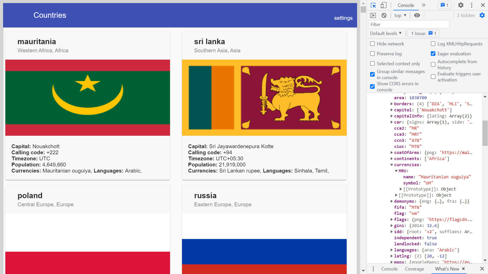

# :zap: Angular Api Countries

* Angular dev app that displays details about countries using data from the [Rest Countries](https://restcountries.eu/) API.
* **Note:** to open web links in a new window use: _ctrl+click on link_


## :page_facing_up: Table of contents

* [:zap: Angular Api Countries](#zap-angular-api-countries)
  * [:page_facing_up: Table of contents](#page_facing_up-table-of-contents)
  * [:books: General info](#books-general-info)
  * [:camera: Screenshots](#camera-screenshots)
  * [:signal_strength: Technologies](#signal_strength-technologies)
  * [:floppy_disk: Setup](#floppy_disk-setup)
  * [:computer: Code Examples](#computer-code-examples)
  * [:cool: Features](#cool-features)
  * [:clipboard: Status & To-Do List](#clipboard-status--to-do-list)
  * [:clap: Inspiration](#clap-inspiration)
  * [:file_folder: License](#file_folder-license)
  * [:envelope: Contact](#envelope-contact)

## :books: General info

* Uses the model-view-viewmodel (MVVM) of Angular to bind the remote data that is stored in objects in the application template. The component plays the part of the controller/viewmodel. The template represents the view.
* Basic app that gets API country data and displays it in a flex grid

## :camera: Screenshots

.

## :signal_strength: Technologies

* [Angular v14](https://angular.io/)
* [Angular HttpClient](https://angular.io/guide/http) module used to communicate with back-end services via the XMLHttpRequest browser interface.
* [Angular KeyValuePipe](https://angular.io/api/common/KeyValuePipe) to transform Object or Map into an array of key value pairs. Output array ordered by keys.
* [RxJS Library v7](https://angular.io/guide/rx-library) used to [subscribe](http://reactivex.io/documentation/operators/subscribe.html) to the API data [observables](http://reactivex.io/documentation/observable.html).
* [Angular Material Design v14](https://material.angular.io/) used for the user interface, especially [mat-menu](https://material.angular.io/components/menu/overview), [mat-sidenav](https://material.angular.io/components/sidenav/overview), [mat-card](https://material.angular.io/components/card/overview) etc.
* [restcounties API v3](https://restcountries.com/) information about countries via a RESTful API. Note their latest endpoints used - they changed from .eu to .com and REST JSON format changed

## :floppy_disk: Setup

* Run `npm i` to install dependencies.
* Run `ng serve` for a dev server. Navigate to `http://localhost:4200/`. The app does automatically reload if you change any of the source files.
* Run `npm run build` to create build files in `docs` folder. These will be deployed to github-pages. You need to copy the `index.html` file in the `docs` folder and paste it in the same folder with a new name of `404.html`.

## :computer: Code Examples

* extract from `data.service.ts` to get country data using Angular httpClient module.

```typescript
  // function to get info for all countries
getCountries() {
  return this.http
    .get(`${this.API_URL}/all`)
    .pipe(map(
      result => this.result = result
    ));
}
```

## :cool: Features

* Angular httpClient used to get data from an API - no API key is required.

## :clipboard: Status & To-Do List

* Status: Working. Menu links do not work
* To-Do: Add user search of country etc. Menu

## :clap: Inspiration

* [Stackoverflow: access key and value of object using *ngFor](https://stackoverflow.com/questions/35534959/access-key-and-value-of-object-using-ngfor) to access key-value pairs from API data for currencies etc.

## :file_folder: License

* This project is licensed under the terms of the MIT license.

## :envelope: Contact

* Repo created by [ABateman](https://github.com/AndrewJBateman), email: gomezbateman@yahoo.com
